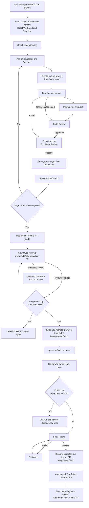

# Gameplay HUD Team Git Workflow

## 1. Selected Git Workflow and Rationale

Our team uses the **Feature Branch Workflow**.

Previously, each team member kept a personal branch. However, personal branches were not clearly tied to actual units of work, and some members did not use Git actively, which created unnecessary complexity.

Going forward, instead of maintaining branches per person, we create a feature branch for each concrete task or feature as it arises.

We chose the Feature Branch Workflow for the following reasons:

* Multiple tasks can proceed in parallel.
* The branch name alone shows what the branch is for.
* `main` can be kept as a stable integration and reference branch.
* Changes for each feature can be reviewed and tested independently.
* Long-lived personal branches are reduced.
* Dependencies and scope overlaps with other teams are easier to manage.

## 2. Branch Strategy

Our team uses two kinds of branches:

* `main`
* `feature/`

### main

`main` is our team's integration and reference branch.

When another team's PR is merged into `upstream/main` and changes occur, the Integration Manager synchronizes our team's `main` with the latest `upstream/main`.

No development is done directly on `main`.

All work — feature development, bug fixes, and documentation changes — is done on a feature branch and integrated into `main` after review and testing.

### feature/

A feature branch is created for one concrete task or purpose.

Branch names are based on the content of the work, not the name of the person doing it.

Examples:

* `feature/game-over-score`
* `feature/high-score-layout`
* `feature/score-display`
* `feature/update-git-workflow`

A feature branch is created from the latest `main` when the work actually starts.

Once the work is complete and review, testing, and merge have finished normally, the feature branch is deleted.

The basic branch lifecycle is:

latest main → create feature branch → develop → review/test → merge into main → delete feature branch

## 3. Commit Rules

One feature branch represents one concrete task or purpose.

A branch may contain multiple commits.

Each commit contains only one logical change.

Unrelated changes are not combined into a single commit.

When one logical change requires modifying several files, those file changes may be included in the same commit.

For example, the `feature/game-over-score` branch may contain commits such as:

* `feat: add final score display`
* `fix: correct score update logic`
* `test: add game over score test`

A small task may contain only one commit.

Example:

* Branch: `feature/update-git-workflow`
* Commit: `docs: update Git workflow`

Commits are not created indiscriminately for every tiny change; they are created when a meaningful development step is complete.

### Commit Message Format

Commit messages follow this format:

```
<type>: <short description>
```

The following types are used:

| Type | Meaning |
| --- | --- |
| `feat` | Add a new feature |
| `fix` | Fix a bug |
| `docs` | Documentation change |
| `refactor` | Code restructuring without behavior change |
| `test` | Test-related change |
| `chore` | Configuration or maintenance work |

Examples:

* `feat: add final score display`
* `fix: correct game over score calculation`
* `docs: update Git workflow`
* `refactor: simplify HUD score handling`

Vague commit messages whose purpose is unclear, such as `update`, `final`, `fix`, or `work`, are not used.

## 4. Pull Request and Code Review Rules

### Internal Pull Request

All development changes are integrated into our team's `main` through a pull request.

A Developer opens an internal PR from a feature branch to `main` when the following conditions are met:

* The assigned task is complete.
* The Developer has completed a basic functional check.
* Known dependencies have been checked.
* The branch is in an integrable state.

### Developer and Reviewer

When a task is assigned, a Developer and a Reviewer are designated together.

The Reviewer must be a team member other than the Developer, and preferably a development team member who understands the relevant feature or code area.

The Reviewer checks the following:

* Whether the changes match the purpose of the task
* Whether unrelated changes are included
* Whether there are any obvious technical problems
* Whether the changes could negatively affect other features
* Whether known dependencies have been handled appropriately

Merging an internal PR requires at least one Reviewer approval.

If changes are requested, the Developer fixes them on the same feature branch and requests review again.

### Tester

Eom Jeong-in serves as our team's designated Tester.

The Tester is responsible for most functional testing and checks the following:

* Whether the implemented feature works as intended
* Whether existing gameplay or HUD features have been broken
* Whether reported bugs have been fixed correctly
* Whether the feature is in an integrable state

If the Tester, Reviewer, or another role holder is unable to perform their role due to circumstances, an appropriate team member who can perform that role may step in on their own initiative.

### Integration Manager

Seungwoo serves as our team's Integration Manager.

The Integration Manager's responsibilities are:

* Final merge of internal PRs that have completed review and testing
* Managing integration into our team's `main`
* Synchronizing `upstream/main` with our team's `main`
* Coordinating the integration process when multiple changes affect the same area

Whenever another team's PR is actually merged into `upstream/main`, Seungwoo synchronizes our team's `main` with the latest upstream state.

If Seungwoo is unable to perform the role, another team member capable of handling integration may step in.

### Upstream Pull Request

Our team considers the Upstream PR ready when the predefined Target Work Unit is complete and all required internal integration, review, and testing have been finished.

The Upstream PR process is divided into handling the previous team's Upstream PR and submitting our own team's Upstream PR.

#### Previous Team Upstream PR Review and Merge

When our team's Upstream PR is ready, we first announce it in the Team Leaders Chat.

We then handle the immediately preceding team's Upstream PR according to the following division of roles:

* Seungwoo is responsible for code review of the previous team's Upstream PR.
* If Seungwoo is unable to review, Coordinator Kwanwoo acts as Backup Reviewer.
* The Reviewer checks the previous team's changes, potential conflicts, dependencies with our team's work, and so on.
* If the code review finds no problems and no Merge Blocking Condition exists, Kwanwoo merges the previous team's PR into `upstream/main`.

After the previous team's PR is merged, the updated `upstream/main` is synchronized into our team's `main`.

If a conflict or functional impact occurs during this process, it is resolved according to the rules in Section 5, and the affected features are retested.

#### Our Team Upstream PR Submission

Once the previous team's PR has been merged and the latest `upstream/main` has been synchronized, we perform final testing on our team's changes.

When conflict resolution and final testing are complete and the Upstream PR is ready to submit, Coordinator Kwanwoo creates our team's PR to `upstream/main`.

Only Kwanwoo creates our team's final Upstream PR.

After the PR is created, we announce it in the Team Leaders Chat.

Review and merge of our team's Upstream PR are then handled by the next team preparing their PR.

The overall Upstream PR flow is:

Our team's PR ready → Seungwoo reviews the previous team's PR → Kwanwoo performs backup review if needed → Kwanwoo merges the previous team's PR → Sync `upstream/main` → Resolve conflicts and final testing → Kwanwoo creates our team's Upstream PR → Next preparing team reviews/merges our PR

### Direct Push to main

Pushing development changes directly to `main` is not allowed.

Feature development, bug fixes, and documentation changes are all done on feature branches and integrated through PRs.

The only exception is the work of synchronizing our team's `main` with the latest `upstream/main`, which is handled by the Integration Manager.

## 5. Merge Strategy

Our team uses a **regular merge** as the default integration method.

In the normal workflow, we do not use Squash Merge or Rebase.

This preserves the individual commit history created during feature development, prevents rewriting of shared commit history, and lets all team members work in the same way.

### Feature Branch → main

When an internal PR passes review and testing, Seungwoo merges the feature branch into `main` using a regular merge.

Once the merge is complete, the feature branch is deleted.

### Bringing the latest main into a feature branch

When a feature branch needs the latest changes from `main`, we use merge instead of rebase.

A feature branch does not need to be updated immediately every time `main` changes.

The latest `main` is brought into a feature branch in the following situations:

* When the latest changes affect that feature
* When needed before internal integration
* When preparing our team's Upstream PR

### Merge Conflict Resolution

The person responsible for resolution depends on the type of conflict.

#### Conflict between a feature branch and main

When a conflict occurs between a feature branch and the latest `main`, the Developer responsible for that feature resolves it first.

After resolving the conflict, the result is reviewed and tested again.

#### Conflict between our team's own features

When two of our team's features conflict with each other, the Developers responsible for each feature resolve it together.

One Developer must not arbitrarily remove or change behavior intended by another Developer.

The Integration Manager coordinates the resolution process when needed.

#### Conflict with another team's changes

When a conflict occurs with a meaningful feature or code developed by another team, our team does not arbitrarily choose one side.

We follow this process:

Identify the conflict → Communicate with the relevant team → Confirm intended behavior and dependencies → Agree on a resolution → Resolve the conflict → Retest

We do not arbitrarily overwrite another team's meaningful changes.

Simple conflicts that do not affect program behavior, such as formatting or import order, may be resolved directly by the responsible Developer.

### Merge Blocking Conditions

A merge does not proceed in the following situations:

* No Reviewer approval
* Unresolved merge conflict
* A required test has failed
* An unconfirmed dependency exists

If the Reviewer judges that changes are needed, those changes must be made first and reviewed again.

If a merge conflict occurs, it must be resolved according to the Conflict Resolution rules above.

If a required test fails, the problem must be fixed and the test run again.

If a dependency on another feature, shared code, or another team's work is unconfirmed, the relevant person or team must be contacted first to clarify the dependency and scope.

After resolving a meaningful conflict or dependency issue, the affected features must be retested.

A merge proceeds only when all Merge Blocking Conditions have been cleared.

## 6. Overall Development Workflow

### 1. Set the Target Work Unit and Internal Deadline

Before development starts, the Dev Team identifies the technical work needed for the next development stage and proposes an appropriate scope that can be included in the next Upstream PR.

The Team Leader and Coordinator Kwanwoo jointly confirm the final Target Work Unit.

The following are considered when deciding the Target Work Unit:

* Current project priorities
* Technically feasible scope
* Dependencies on other teams
* Testability
* Expected development schedule

A Target Work Unit may be a single task or a bundle of related tasks.

It is sized so that it can be completed and tested within one development cycle while still delivering a meaningful change to the project.

When the Target Work Unit is confirmed, an Internal Deadline is also set.

The purpose of the Internal Deadline is to prevent development from dragging on unnecessarily and to let the team predict when the PR will be ready.

The deadline accounts for the time needed for:

* Development
* Code review
* Integration
* Functional testing

If work is blocked by an unexpected dependency or technical problem, the Dev Team shares this, and the Team Leader and Coordinator discuss whether to adjust the scope of the Target Work Unit or move the task to the next Work Unit.

We do not delay the entire PR indefinitely because of one unfinished task.

### 2. Check Dependencies

Before starting each task, we check for dependencies or scope overlaps with the following:

* Other features in our team
* Shared code or interfaces
* Other teams' features
* Data or logic managed by other teams

If a dependency is unclear, we communicate with the relevant team before starting changes with overlapping scope.

Examples currently being confirmed in the project:

* **Frenchies (Main Menu)**
  Confirming ownership of the Game Over / Final Score display area

* **Chinese can fly (Records & Achievements System)**
  Confirming the scope of Gameplay Score and Final Score calculation and handling

### 3. Assign Roles

Once the Target Work Unit is set, a Developer and a Reviewer are assigned to each task.

Eom Jeong-in, as the designated Tester, is responsible for most functional testing.

### 4. Create a Feature Branch and Develop

The Developer creates a feature branch for the task from the latest `main`.

Then:

1. Develop the assigned task
2. Commit at each meaningful development step
3. Use the agreed commit message format
4. Bring in the latest `main` changes when needed
5. Open an internal PR when the work is complete

### 5. Review, Test, and Integration

The Reviewer reviews the internal PR.

If changes are needed, the Developer fixes the same feature branch and requests review again.

Once the review is approved, Eom Jeong-in tests the feature.

Once testing passes, Seungwoo merges the feature branch into our team's `main`.

After the merge, the feature branch is deleted.

This process repeats until all tasks in the Target Work Unit are handled.

### 6. Prepare the Upstream PR and Handle the Previous Team's PR

When the Target Work Unit is complete and the required internal review, integration, and testing are finished, we announce in the Team Leaders Chat that our team's PR is ready.

We then handle the previous team's Upstream PR in this order:

1. Seungwoo reviews the immediately preceding team's Upstream PR.
2. If Seungwoo is unable to review, Kwanwoo acts as Backup Reviewer.
3. The Reviewer checks the changes, dependencies, potential conflicts, and Merge Blocking Conditions.
4. If problems are found, we communicate the necessary details to the relevant team.
5. If the review finds no problems and no Merge Blocking Condition exists, Kwanwoo merges the previous team's PR into `upstream/main`.

### 7. Sync the Latest Upstream and Final Validation

After the previous team's PR is merged into `upstream/main`:

1. Seungwoo synchronizes the updated `upstream/main` into our team's `main`.
2. Any necessary latest changes are applied to our work.
3. If conflicts occur, they are resolved according to the rules in Section 5.
4. Features affected by other teams' changes are retested.
5. We confirm that all Merge Blocking Conditions have been cleared.
6. Final testing is performed.

### 8. Create Our Team's Upstream PR

Once final validation is complete, Coordinator Kwanwoo creates our team's PR to `upstream/main`.

After the PR is created, we announce it in the Team Leaders Chat.

Review and merge of our team's Upstream PR are then handled by the next team preparing their PR.

### Workflow Diagram


