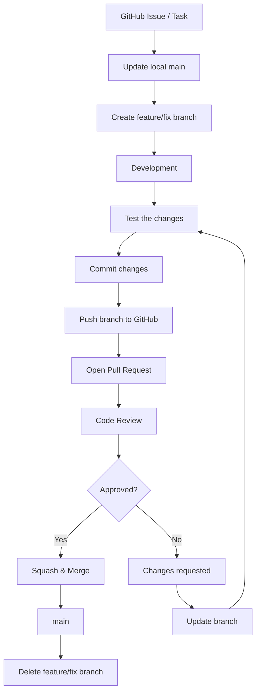

# KimchiBaguette: Git Workflow

## 1. Workflow and rationale

Our team uses **GitHub Flow** — a single long-lived `main` branch, short-lived
branches for each task, and a mandatory Pull Request with review before anything
reaches `main`.

### Why GitHub Flow fits this project

- **`main` must always be runnable.** This repository has no automated test
  suite, so we verify a change by building and running `engine.Core` by hand.
  Keeping one always-working branch makes that verification meaningful.
- **Code review is our only quality gate.** Because there are no tests to catch
  regressions, the mandatory PR review is what protects `main`. GitHub Flow puts
  that review at the centre of the process rather than treating it as optional.
- **Short-lived branches keep conflicts small.** We are nine developers, the
  largest team in the course, and much of our work lands in the same few files
  (`GameScreen.java`, `EnemyShipFormation.java`). The longer a branch lives, the
  harder its conflicts become. Merging small pieces often is the cheapest way to
  avoid that.
- **It is simple enough for the whole team to follow.** Most members are in
  their second year and this is their first multi-person Git project. One
  long-lived branch and one kind of short-lived branch is a rule set everybody
  can hold in their head. A workflow that is misunderstood is worse than a
  simple one, because a botched merge blocks the rest of the project.
- **It matches the tools we already use.** Branch, PR, review, approval, squash
  merge and branch deletion all happen in the GitHub web UI, so no extra tooling
  or local setup is required.

### Why we did not choose the other common workflows

| Workflow | Why it does not fit our team |
| --- | --- |
| **Centralized Workflow** | Everyone commits straight to one shared branch with no branches and no PR step. With nine people editing the same files there would be a conflict on almost every push, and removing the PR step would remove the only review gate we have. |
| **Feature Branch Workflow** | This is the closest alternative, and GitHub Flow is essentially it plus a required PR and review. We want the review step to be a rule rather than a convention, so we chose the stricter version. |
| **Forking Workflow** | Each member would work in a personal fork and open cross-fork PRs, which means every member maintains an extra remote and keeps it in sync. All nine of us already have write access to the team repository, so the extra layer buys us nothing and is a common source of confusion for members new to Git. A plain branch in one shared repository is simpler. |
| **Gitflow** | It adds `develop`, `release`, `hotfix` and `support` branches on top of feature branches. We ship no versioned releases and run nothing in production during one semester, so there is no release to stabilize and no hotfix to back-port. Five long-lived branch types would be pure ceremony. |
| **GitLab Flow** | It layers environment or release branches (staging, production) on top of GitHub Flow. The game runs locally from IntelliJ and we have no deployment environments, so those branches would always be empty. |
| **Trunk-Based Development** | It expects every developer to merge into the trunk at least daily, usually behind feature flags, and it depends on strong automated tests to keep the trunk green. We have no test suite to catch a broken trunk, and our members are split between France and Korea with different class schedules, so a daily merge cadence is not realistic. |
| **Hierarchical Integration** | Changes pass through lieutenants before reaching a maintainer. It is built for very large numbers of contributors who do not know each other. With nine teammates it would only add waiting time and make the integrator a bottleneck. |

### Repositories

This project has two remotes and they are used for different purposes.

- `origin` — [`YitWub/KimchiBaguette`](https://github.com/YitWub/KimchiBaguette),
  our team's fork. **All of the rules in this document apply here.** Every
  internal PR targets this repository's `main`.
- `fork` — [`oh-gnues/Invaders-SDP-24592`](https://github.com/oh-gnues/Invaders-SDP-24592),
  the shared course repository. We pull from it to stay in sync with the other
  teams, and contributions back to it follow the course maintainers' rules, not
  ours. A PR meant for our team must never target this repository. Only collaborator does the PR for this repository.

## 2. Branch Strategy

1. `main` branch: Always maintain a stable, runnable state (no direct pushes allowed).

2. Working branches: Created anew from `main` when work starts, and named with a prefix that matches the kind of work.

   | Prefix | Used for | Example |
   | --- | --- | --- |
   | `feature/` | A new feature | `feature/weapon-system`, `feature/boss-mechanics` |
   | `fix/` | A bug fix | `fix/boss-collision` |
   | `docs/` | Documentation only | `docs/git-workflow` |

   Use lowercase and hyphens, and keep the name short enough to read in the branch list.

3. Merge Conditions: Merge into `main` via PR after at least one team member has completed the code review and approval.

4. Branch Deletion: Delete the corresponding working branch immediately after the merge is complete to keep the remote repository tidy.

## 3. Commit Rules

A single commit contains only one clear feature addition, modification, or documentation change. Do not include unrelated changes together in a single commit.

For example, even if the Boss System implements both the Boss movement and attack functions simultaneously, commit them separately by function whenever possible.

### Commit Message Format

Use the following format:

`[Type] Short description`

The types to use are as follows:

- `[Feat]` : Add new features

- `[Fix]` : Fix bugs

- `[Refactor]` : Improve code structure without changing functionality

- `[Docs]` : Modify documentation such as README

- `[Test]` : Add or modify test code

- `[Style]` : Modify code style and formatting

### Commit Examples

`[Feat] Add boss movement system`

`[Feat] Add boss multi shot attack`

`[Fix] Resolve boss collision bug`

`[Fix] Fix player ship movement issue`

`[Docs] Update boss system PRD`

`[Refactor] Simplify enemy movement code`

Commit messages should be written to clearly and simply describe the changes.

## 4. Pull requests and review

Create a Pull Request (PR) once feature development is complete and basic testing is finished.

Before creating a PR, verify the following:

- Verify that the feature is functioning correctly.

- Verify that no issues have occurred with the existing feature.

- Remove unnecessary debugging code or comments.

- Verify that the commit message complies with team rules.

### Pull Request Rules

- All development should be conducted on a `feature/*`, `fix/*` or `docs/*` branch.

- Once development is complete, create a PR targeting the `main` branch of our team repository, [`YitWub/KimchiBaguette`](https://github.com/YitWub/KimchiBaguette). Never target the shared course repository; only the collaborator opens PRs there.

- Clearly describe the changes made in the PR title.

- Briefly describe the implemented features and test details in the PR description.

- Merge after obtaining code review and approval from at least **one other team member**.

- If parts requiring modification are found during the review, modify them and request a review again.

- Direct Push to the `main` branch is not allowed.

- All changes must be reflected in `main` via a Pull Request.

### Pull Request Example

Title:

`[Feat] Add boss attack system`

Description:

```text
### Changes

- Added boss single shot attack

- Added boss multi shot attack

- Added attack interval

### Test

- Tested single shot

- Tested multi shot

- Tested attack interval
```

## 5. Merge Strategy

Our team uses the **Squash and Merge** method.

Merging multiple working commits into a single commit and reflecting it in the `main` branch.

### Reasons for Using Squash and Merge

- It allows you to consolidate multiple working commits for a single feature into one.

- It keeps the commit history of the `main` branch clean.

- It prevents unnecessary commits generated during the modification process from remaining in `main`.

- It makes it easy to view the features worked on by team members as a single unit.

### Conflict Resolution

Most of our work lands in a small number of shared files, above all
`GameScreen.java` and `EnemyShipFormation.java`, so conflicts are expected
rather than exceptional. The team handles them as follows.

- **Prevent first.** Update your branch from `main` before opening a PR, and
  again whenever `main` moves while your PR is waiting for review. A PR that
  GitHub reports as conflicting is not ready to be reviewed.
- **Keep branches short.** A branch that lives for days accumulates conflicts
  that nobody can safely resolve. Split large work into several smaller PRs.
- **The author resolves.** Conflicts are resolved by the PR author on their own
  branch, never on `main`. The author knows their own intent; the reviewer does
  not.
- **Ask the other author when the conflict is not yours alone.** If the
  conflicting change belongs to another member, the two authors resolve it
  together instead of one of them guessing. Deleting or overwriting someone
  else's code to make a conflict disappear is not allowed.
- **Re-test after resolving.** A resolved conflict is a new state of the code
  that nobody has run yet, so build and run the game again before pushing.
- **Escalate if it will not resolve.** If the two authors cannot agree, the team
  leader decides, and the change may be split into smaller PRs that land in
  sequence.

## 6. Overall workflow

The diagram below shows the complete process, from picking up a task to
deleting the branch.


